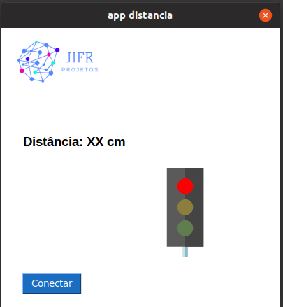
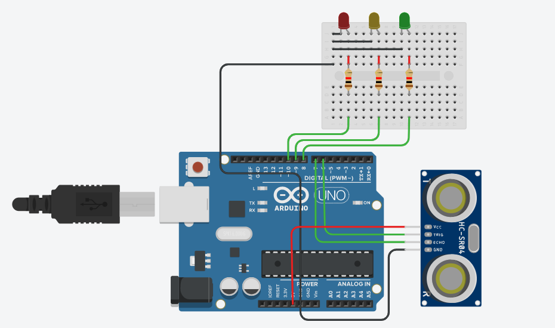

# P1-ARDUINO
> Projeto de um simulador de sinaleiro utilizando arduino e tkinter.  

Consiste na simulação de um sinaleiro que com base na distância medida aciona algum dos LEDS. 
Para ajudar na vizualização foi desenvolvida uma interface utilizando o Tkinter.





## Exemplo de uso

Transfira o código de exemplo disponível em <b>files_arduino<b> para seu Arduino. Depois é só rodar a aplicação  disponível na pasta <b>sinaleiro<b>.

```sh
    python3 app.py
```

## Módulos para interface.

* python3-tk
* pyserial


## Componentes necessários Arduino:

* Arduino UNO ou similar.
* Sensor Ultrassônico – HC-SR04
* 3 LEDs.
* Fios Jumper’s
* Protoboard
  
